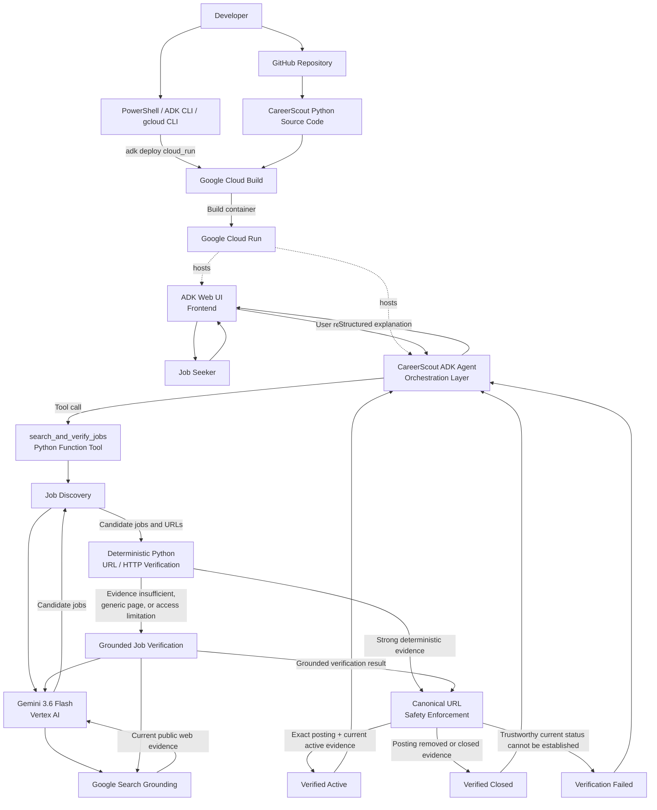

# CareerScout Architecture

CareerScout is an autonomous job discovery and verification agent built with Google ADK, Gemini 3.6 Flash on Vertex AI, Google Search grounding, deterministic Python verification, and Google Cloud Run.

The architecture separates two concerns:

1. **Development and deployment**
2. **Runtime job discovery and verification**

---

## System Architecture



---

## Core Workflow

**Scout → Verify → Explain**

1. The user provides a resume, target role, location, constraints, or a specific job URL.
2. The ADK Web UI sends the request to the CareerScout ADK agent.
3. The agent interprets the request and invokes the `search_and_verify_jobs` Python tool.
4. Gemini 3.6 Flash on Vertex AI uses Google Search grounding to discover current job candidates.
5. Every discovered URL passes through deterministic Python URL and HTTP verification.
6. If the page contains enough trustworthy evidence, the result can continue directly to canonical URL enforcement.
7. If evidence is incomplete, generic, restricted, or ambiguous, CareerScout performs grounded verification using Gemini and Google Search.
8. Python independently enforces the canonical direct posting URL before a job can be labeled `verified_active`.
9. Results are returned as:
   - **Verified Active**
   - **Verified Closed**
   - **Verification Failed**
10. The CareerScout agent explains the result back to the user through the ADK Web UI.

---

## Frontend and Backend Interaction

### Frontend

The **Google ADK Web UI** acts as the user-facing interface.

The user can provide requests such as:

```text
Find entry-level AI Engineer jobs in the San Francisco Bay Area and verify the openings.
```

or provide a resume and ask CareerScout to infer relevant early-career roles.

### Backend

The backend consists of:

- CareerScout ADK agent
- `search_and_verify_jobs` Python function tool
- Gemini 3.6 Flash through Vertex AI
- Google Search grounding
- deterministic Python verification logic
- canonical URL safety enforcement

The ADK agent coordinates the workflow, while Python controls mandatory verification behavior.

---

## Development and Deployment Flow

CareerScout is developed locally using Python and Google ADK.

Deployment flow:

```text
Developer
   ↓
PowerShell / ADK CLI / gcloud CLI
   ↓
CareerScout source code
   ↓
Google Cloud Build
   ↓
Container image
   ↓
Google Cloud Run
```

GitHub stores the public source code, architecture documentation, setup instructions, and reproducibility information.

The CLI is used for development and deployment. It is not part of the normal end-user runtime workflow.

---

## Google Cloud Components

### Google Cloud Run

Hosts the deployed CareerScout ADK application.

### Vertex AI

Provides access to Gemini 3.6 Flash.

### Google Cloud Build

Builds the CareerScout container during Cloud Run deployment.

### Google ADK

Provides agent orchestration, function-tool execution, and the development web interface.

### Google Search Grounding

Provides current public-web evidence for job discovery and verification.

---

## Verification Architecture

CareerScout deliberately separates **discovery** from **verification**.

A discovered job is not automatically trusted.

### Layer 1 — Discovery

Gemini + Google Search identifies potentially relevant openings.

### Layer 2 — Deterministic URL Verification

Python checks:

- URL protocol
- hostname
- redirect destination
- HTTP response
- whether the page appears job-specific
- title and company identity
- active or closed page signals

### Layer 3 — Grounded Verification

When deterministic evidence is insufficient, Gemini performs an independent grounded search for the exact role.

### Layer 4 — Canonical URL Enforcement

Before `verified_active` is allowed, Python checks that:

- an exact individual posting URL exists
- the final URL remains job-specific
- the page is reachable
- the page corresponds to the expected title and company
- current evidence supports an active posting

---

## Reliability Principle

CareerScout does not treat any of the following as sufficient proof that a job is active:

- a search result
- HTTP 200 alone
- a company careers homepage
- a generic ATS board
- an old aggregator listing
- a model-generated URL without independent validation

A `verified_active` result must survive the canonical URL and current-status verification pipeline.

If CareerScout cannot establish trustworthy current evidence, it returns:

```text
verification_failed
```

instead of presenting the opening as confirmed.

This is intentional.

CareerScout is designed to prefer uncertainty over false confidence.

---

## Result States

### Verified Active

The exact individual posting is supported by current evidence and passes canonical URL verification.

### Verified Closed

Reliable evidence indicates the exact posting has been removed, closed, filled, expired, or is no longer accepting applications.

### Verification Failed

CareerScout could not establish a trustworthy current status.

This does **not** automatically mean the job is fake or unavailable.

---

## Current Architecture Scope

The current hackathon MVP focuses on:

- autonomous job discovery
- resume-informed role interpretation
- current-web search
- deterministic URL verification
- grounded fallback verification
- canonical job URL enforcement
- active / closed / failed classification
- explainable results

Not yet implemented:

- deterministic candidate qualification scoring
- automatic application submission
- persistent job history
- exhaustive market coverage
- long-term user memory